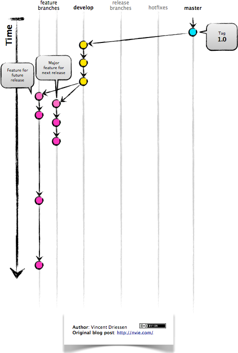
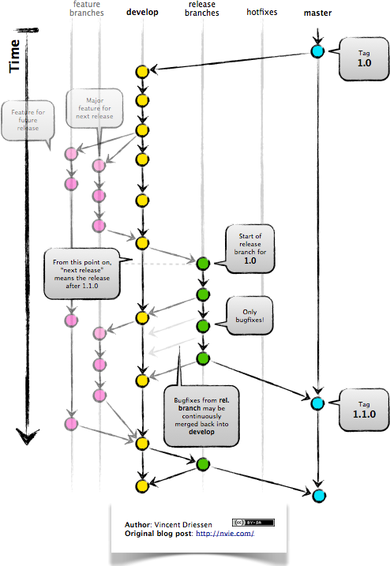

# GitFlow

 GitFlow is a branching model for Git. It dictactes a set of rules / guidelines that developers can follow while working on a project. 
 
 There are 2 main branches while working on git
 
 -  Master branch
 -  Develop branch
 
 
## Master Branch
 
 The master branch contains the official release history of the project. All the final releases of the product are released on to the master branch. Each update on the master branch is tagged with a version number. This helps to keep track of the changes to the project.
 
## Develop Branch 
 
The develop branch is where the all the new features are built. In order to build a new feature, the latest version of the master branch is copied onto the develop branch and all the development and testing takes place on the develop branch.

# Working of gitFlow

New development (new features, non-emergency bug fixes) are built in feature branches:

Feature branches are branched off of the develop branch, and finished features and fixes are merged back into the develop branch when they’re ready for release:

When it is time to make a release, a release branch is created off of develop:

The code in the release branch is deployed onto a suitable test environment, tested, and any problems are fixed directly in the release branch. This deploy -> test -> fix -> redeploy -> retest cycle continues until you’re happy that the release is good enough to release to customers.

When the release is finished, the release branch is merged into master and into develop too, to make sure that any changes made in the release branch aren’t accidentally lost by new development.

The master branch tracks released code only. The only commits to master are merges from release branches and hotfix branches.
Hotfix branches are used to create emergency fixes:

They are branched directly from a tagged release in the master branch, and when finished are merged back into both master and develop to make sure that the hotfix isn’t accidentally lost when the next regular release occurs.

## Sources

1.  [Introduction to GitFlow](https://www.atlassian.com/git/tutorials/comparing-workflows/gitflow-workflow)

2.  [Working of GitFlow](https://datasift.github.io/gitflow/IntroducingGitFlow.html)
